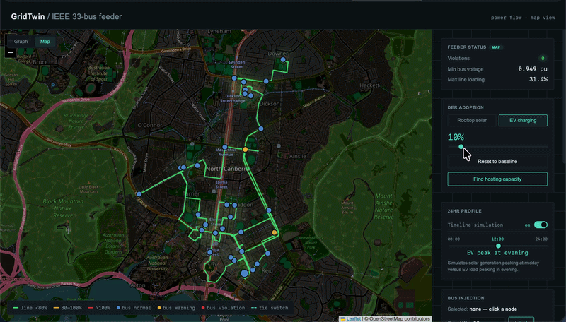

# GridTwin

A CIM-flavoured distribution network simulator: load an IEEE 33-bus feeder,
add rooftop solar / EV chargers to nodes, run AC power flow, and see the
network turn from green to red as adoption climbs.

<p align="center">
  
</p>

Live demo: https://gridtwin-qql0.onrender.com (an earlier build - redeploy
this zip to see the current one; the two don't match)

## Structure

```
gridtwin/
├── Dockerfile
├── docker-compose.yml
├── backend/
│   ├── ieee33_data.py   # Baran & Wu 33-bus branch/load tables
│   ├── cim_network.py   # builds the feeder as zepben.ewb CIM objects
│   ├── ewb_client.py     # optional: fetch a feeder from a live EWB server instead
│   ├── converter.py     # CIM NetworkService -> pandapower net
│   ├── network.py       # Feeder class: graph model + DER logic
│   ├── timeseries.py     # daily load/DER profiles + time-series hosting-capacity sweep
│   ├── data/              # real interval data backing timeseries.py's profiles - see PROFILES.md
│   ├── geo.py            # synthetic bus coordinates + OSRM routing for the map view
│   └── main.py            # FastAPI app (also serves frontend/)
└── frontend/
    ├── config.js          # runtime API base URL
    └── index.html         # React + Cytoscape.js dashboard
```

## Run it

**Docker (single container, backend + frontend, no CORS setup needed)**
```bash
docker compose up --build
# visit http://localhost:8000
```

**Manual**
```bash
# Backend
cd backend && python3 -m venv venv && source venv/bin/activate && pip install -r requirements.txt && uvicorn main:app --reload --port 8000

# Frontend - first uncomment the GRIDTWIN_API_BASE line in frontend/config.js
cd frontend && python3 -m http.server 8080
# visit http://localhost:8080
```

**Tests**
```bash
cd backend && source venv/bin/activate && pytest -v
```

## API

| Endpoint | Method | Purpose |
|---|---|---|
| `/network` | GET | topology (nodes + edges) for the graph view |
| `/status` | GET | current power-flow result, no changes |
| `/adoption-slider` | POST | uniform adoption %: `{"adoption_pct": 60, "kind": "solar"}` |
| `/hosting-capacity` | GET | sweep 0→100% adoption, returns the breach point |
| `/daily-profile` | GET | 24hr time-series sweep: `?kind=solar&adoption_pct=100` - load and DER output scaled hour-by-hour, not a single snapshot |
| `/annual-profile` | GET | seasonal (12-month) sweep: `?kind=solar&adoption_pct=100` - 288 solves, one representative day per calendar month, from real interval data (see `PROFILES.md`) |
| `/reset` | POST | clear all DERs |
| `/api/network/geojson` | GET | topology + status as GeoJSON, for the map view |
| `/api/grid/simulate` | POST | single-node solar injection: `{"node_id": 4, "solar_kw": 50}` |

## Design notes

- **Network**: the 33-bus feeder is built as real `zepben.ewb` CIM objects
  (`cim_network.py`) from the published Baran & Wu tables
  (`ieee33_data.py`), then converted to a pandapower model by
  `converter.py`. It's built from the published table rather than a live
  EWB-server query or a real CIM RDF/XML file by default - see below for
  the live-server path.
- **Live EWB server** (`ewb_client.py`): set `GRIDTWIN_EWB_HOST` and
  `Feeder` fetches a feeder from a real Energy Workbench server over
  gRPC instead of building it locally - `converter.py` doesn't change
  at all, since it only ever reads a `NetworkService`. Other env vars:
  `GRIDTWIN_EWB_PORT`, `GRIDTWIN_EWB_FEEDER_MRID`, `GRIDTWIN_EWB_TOKEN`,
  `GRIDTWIN_EWB_VN_KV`, `GRIDTWIN_EWB_BASE_MVA` (all optional). Confirmed
  against the real wire contract (`zepben/ewb-grpc`), not run against a
  real server - see `LIMITATIONS.md`.
- **Baseline load** is scaled down (0.55x) so the feeder starts healthy;
  the stock benchmark is already voltage-stressed at full load, leaving
  nothing to add before it goes red.
- **DER sizing**: each bus represents a neighborhood cluster (~60 kW
  average), not one house, so adoption % scales DER capacity relative to
  that node's own baseline load rather than a flat kW-per-house figure.
- **Voltage bands**: approximate ANSI C84.1 Range A/B (0.95–1.05 normal,
  down to 0.917/up to 1.058 warning, beyond that a violation).
- **Time-series hosting capacity** (`timeseries.py`): `/daily-profile`
  re-solves once per hour of a real (not synthetic) day so overvoltage
  shows up at its actual trigger - midday minimum load + peak solar -
  instead of being implied by the adoption % alone. `/annual-profile`
  does the same across 12 representative months instead of one blended
  day, so a real seasonal story (Canberra's winter load peak vs. summer
  solar peak) can show up, with a per-bus/per-line summary shaped after
  Zepben's real `AssetLevelVoltageSummaryReport` /
  `AssetLevelThermalLoadingSummaryReport` proto messages. See
  `timeseries.py`'s docstrings for the mechanics, `PROFILES.md` for the
  data, and `LIMITATIONS.md` for what the report mapping leaves out.
- **State**: one `Feeder` is shared by every request (see `_feeder_lock`
  in `main.py`) rather than one per session - every viewer of the live
  demo sees the same grid state. Fine for a single-demo deployment; two
  people adjusting the slider at once will see each other's changes.

See `LIMITATIONS.md` for what's simplified vs. a real utility model,
and `PROFILES.md` for where the daily load/solar profiles come from.
